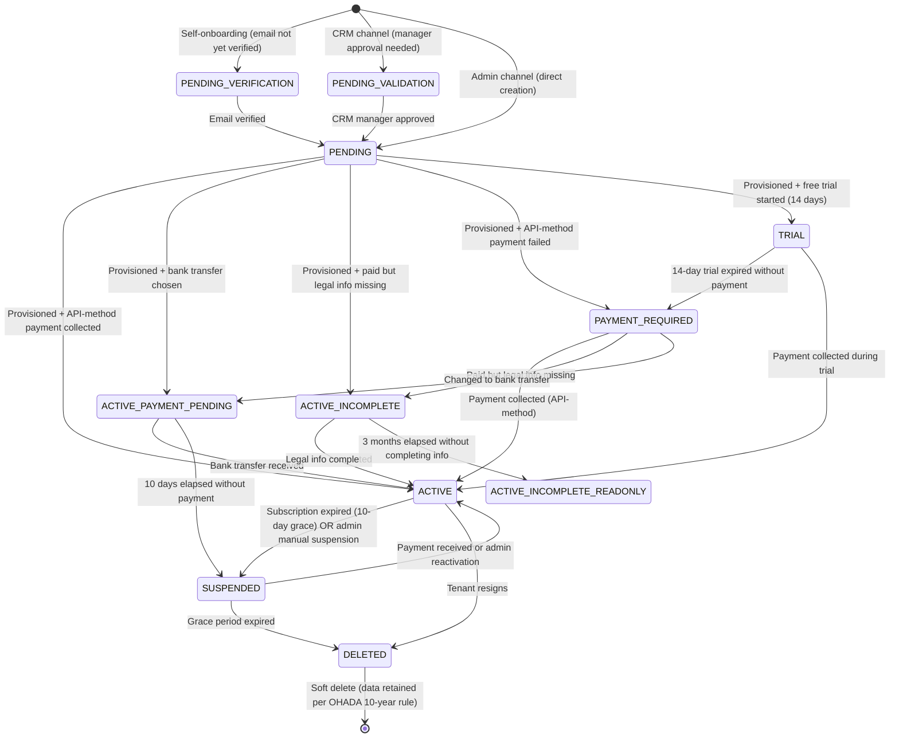
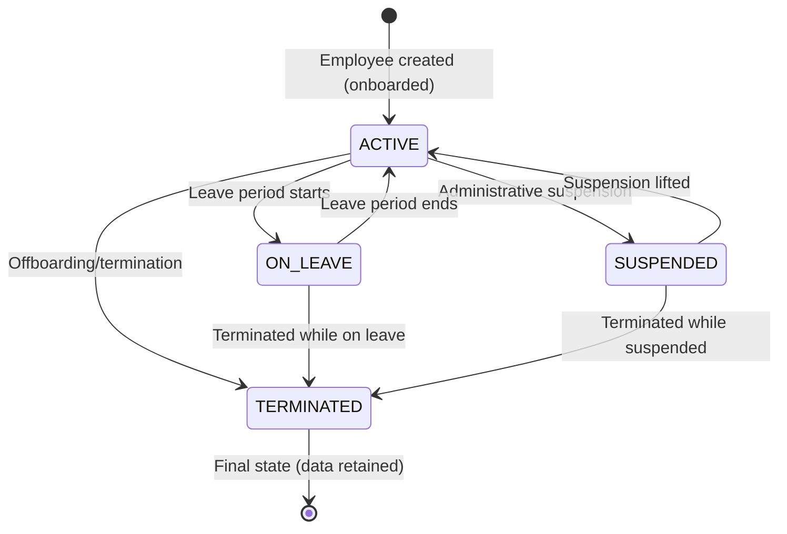
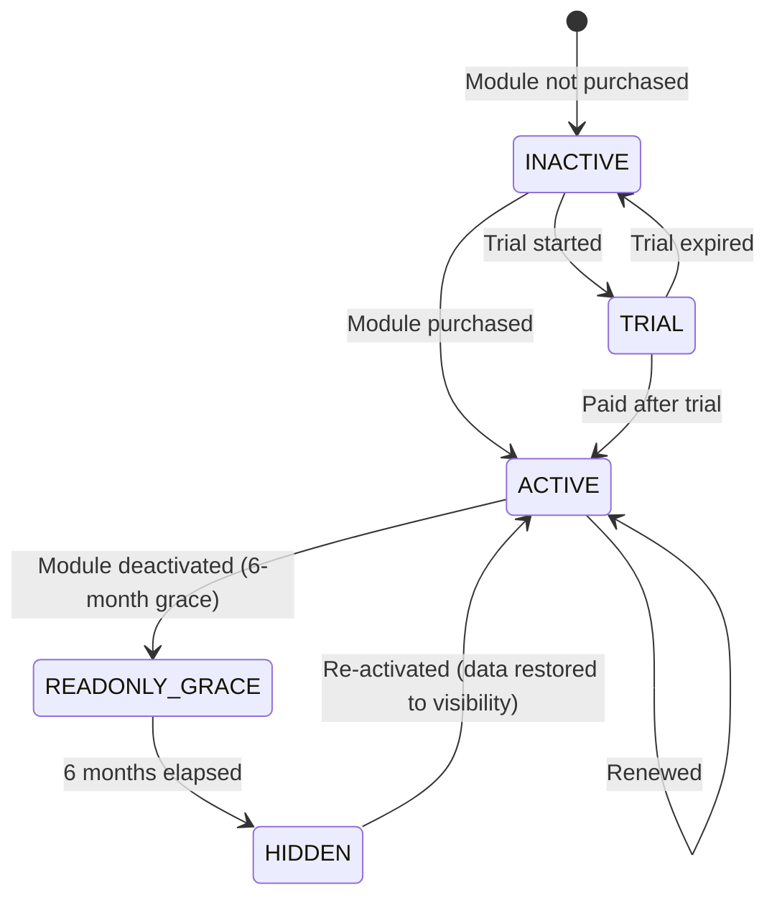

# Platform Vision — PRD+FSD Hybrid
# Product: Both (Papillon HR Suite + ALTARYS ENTERPRISE HR Suite)
# Country Scope: CI (Côte d'Ivoire) — MVP
# Version: 1.0
# Date: 25/02/2026
# Author: ANALYST (Claude Code)
# Input documents:
#   - docs/specs/platform-vision.md (Tier 1 human-written spec)
#   - docs/specs/control-plane.md (Tier 2 control plane spec)
#   - docs/specs/tarifs_papillon_hr_suite.md (pricing grid)
#   - docs/specs/comparatif-altarys-concurrence.md (competitive analysis)
#   - docs/research/3_validated/platform-vision-legal-validated.md (legal research audit)
#   - docs/research/2_audit/platform-vision-legal-audit.md (legal audit gaps)

---

# PART A — Product Requirements (PRD)

---

## A.1 Executive Summary

**ALTARYS ENTERPRISE** is building a multi-tenant SaaS platform for HR management and corporate finance, purpose-built for businesses operating under the **OHADA** (Organisation pour l'Harmonisation en Afrique du Droit des Affaires) legal framework across 17 member states.

### The Problem

Businesses in the OHADA zone — particularly SMEs — manage HR and payroll using Excel spreadsheets, paper registers, and manual processes. This creates:

- **Compliance risk**: OHADA Uniform Acts, SYSCOHADA accounting standards, and national labor codes impose complex, country-specific obligations. Manual processes lead to errors in CNPS declarations, tax filings, and employee registers.
- **Operational inefficiency**: Leave approvals via WhatsApp, attendance tracked on paper, payslips computed manually in Excel — HR managers spend 60-80% of their time on administrative tasks instead of strategic work.
- **Data fragility**: No audit trail, no backup, no data integrity. A lost Excel file means lost payroll history.
- **Connectivity challenges**: Intermittent internet in West/Central Africa means cloud-only solutions fail at the moment employees need them most.

### The Solution

ALTARYS delivers two SaaS brands from a **single codebase**:

| Brand | Target | Employees | Phase |
|-------|--------|-----------|-------|
| **Papillon HR Suite** | SMEs (TPE/PME) | 2–350 | Phase 1: Month 1–18 (primary focus) |
| **ALTARYS ENTERPRISE HR Suite** | Large companies (ETI + Grands Comptes) | 351–5,000+ | Phase 2: Month 18+ |

The platform provides **14 modular HR/Finance capabilities** plus a non-sellable **Control Plane** foundation — all built **offline-first**, **mobile-first**, and **OHADA-compliant by default**.

### Scale Target

100,000+ client companies within 5 years.

### Pilot Country

Côte d'Ivoire (CI). Expansion: Bénin + Cameroun (Month 9), RDC (Month 15), Sénégal (Month 18), then progressive rollout across remaining OHADA countries.

---

## A.2 Two-Brand Architecture: Why Single Codebase

**Decision**: ALTARYS operates two commercial brands but maintains a **single backend codebase** deployed on different infrastructure. This is a foundational architectural decision that all teams must understand.

### Why Single Codebase Is Right

| Concern | Two Codebases | Single Codebase (Chosen) |
|---|---|---|
| **Bug fix** | Fix twice, test twice, deploy twice | Fix once, test once, deploy everywhere |
| **Security patch** | Double the attack surface to maintain | One surface, one patch |
| **Feature development** | Decide per-feature which codebase gets it | Build once, gate via configuration |
| **Team size** | Solo dev + small team — maintaining 2 codebases is unsustainable | Sustainable with a small team |
| **Testing** | Two test suites, two CI pipelines | One test suite covers both brands |
| **API consistency** | APIs drift over time, data models diverge | Guaranteed consistency |

### What Differs Between Brands

| Dimension | Papillon HR Suite (SME) | ALTARYS ENTERPRISE HR Suite |
|---|---|---|
| **Code** | Same | Same |
| **Frontend** | `frontend/` — warm, mobile-first, offline-first, forgiving UX | `frontend-enterprise/` — dense data, desktop-first, batch operations, power-user UX |
| **DB Profile** | Shared DB (MVP) | Schema-per-tenant or DB-per-tenant |
| **Deployment** | Shared servers | Dedicated servers (ETI) or dedicated cluster (Grands Comptes) |
| **Module gating** | Standard modules | Standard + Enterprise-only modules/features |
| **SLA** | 99.5% | 99.9% (contractual) |
| **API rate limits** | Standard | Higher |
| **Storage quotas** | Segment-based (S1-S6) | Higher or unlimited |
| **Pricing** | S1-S6 grid (see §A.8) | Custom enterprise pricing |
| **Support** | Self-service + email | Dedicated account manager |

### Tenant Segmentation

| Segment | Brand | Employee Range | Description |
|---|---|---|---|
| **SME** (TPE/PME) | Papillon HR Suite | 2–350 | 6 sub-segments (S1-S6) |
| **ETI** (Entreprise de Taille Intermédiaire) | ALTARYS ENTERPRISE | 351–4,999 | Mid-market |
| **GC** (Grands Comptes) | ALTARYS ENTERPRISE | 5,000+ | Large enterprise |

### Architecture Pattern

```
Same Docker image / Same Spring Boot JAR
        │
        ├── Papillon deployment (shared infrastructure)
        │     └── Shared DB, shared Kubernetes namespace
        │     └── 99.5% SLA, shared resources
        │
        └── Enterprise deployment (dedicated infrastructure)
              └── Schema-per-tenant or DB-per-tenant
              └── 99.9% SLA, dedicated resources
              └── Potentially dedicated cluster per Grand Compte
```

Enterprise-only features (multi-entity consolidation, SSO/SAML, advanced approval chains, batch operations at scale, custom roles, API access for ERP integration) exist in the same codebase but are **gated via module gating + brand/tier flags** on the tenant entity.

**[BOTH]** The shared component library (`packages/shared-components/`) uses **theme injection** — both frontends consume the same components rendered differently based on the brand theme.

---

## A.3 User Personas

### P1: Directeur Général (DG) / CEO — [BOTH]
- **Uses**: Dashboards, approvals (self-approves as Company Owner), high-level reports
- **Digital literacy**: Medium to high
- **Device**: Laptop + phone
- **Key concern**: "Is my business compliant? Show me the numbers."
- **Papillon context**: Often the company owner (gérant SARL). May also be the HR manager in very small businesses (S1-S2).
- **Enterprise context**: Professional CEO with dedicated HR/Finance teams. Needs executive dashboards, not operational screens.

### P2: Responsable RH / HR Manager — [BOTH]
- **Uses**: Employee files (HR Core), onboarding/offboarding (Employee Mgmt), Absence, Payroll oversight
- **Digital literacy**: Medium
- **Device**: Desktop primarily, phone for approvals
- **Key concern**: "Process leave requests quickly, ensure OHADA compliance, track employee lifecycle."
- **Papillon context**: Often the DG's spouse or a trusted employee wearing multiple hats. Transitioning from Excel/paper. Needs hand-holding UX.
- **Enterprise context**: Professional HR Director managing a team of HR officers. Needs batch operations, advanced reporting, delegation workflows.

### P3: Comptable / Accountant — [BOTH]
- **Uses**: Budget lines, commitments, expenses, accounting, payroll read
- **Digital literacy**: Medium to high (uses Excel extensively)
- **Device**: Desktop (dual monitor preferred)
- **Key concern**: "SYSCOHADA compliance, balanced books, audit trail."
- **Papillon context**: Often an external accountant (cabinet comptable) managing 5-20 client companies. **Needs multi-tenant access** via tenant switcher.
- **Enterprise context**: In-house finance controller with dedicated team.

### P4: Employé / Employee — [BOTH]
- **Uses**: Leave requests, viewing payslips, clocking in/out, basic self-service profile view
- **Digital literacy**: Low to medium
- **Device**: Android phone (often entry-level, 8+ years old, intermittent connectivity)
- **Key concern**: "Submit my leave request easily, check my salary, see my profile."
- **Papillon context**: May not have an email address. Account activation via SMS. Needs absolute simplicity.
- **Enterprise context**: More digitally literate. Has corporate email. Expects polished, modern UX.

### P5: Commercial Freelance / Freelance Salesperson — [PAPILLON ONLY]
- **Uses**: Internal CRM — leads, opportunities, prospect→tenant conversion, commissions
- **Digital literacy**: Medium
- **Device**: Phone primarily (always on the move)
- **Key concern**: "Track my leads and see my commissions."
- **Note**: This persona works FOR ALTARYS (or a partner consulting company), not for a tenant.

### P6: Partenaire Consultant / Partner Consulting Company — [PAPILLON ONLY]
- **Uses**: Internal CRM — presents Papillon to their clients, tracks referrals, revenue share (~10%)
- **Digital literacy**: High
- **Device**: Laptop + phone
- **Key concern**: "Track which clients I've referred and my revenue share."
- **Note**: Accesses CRM as a special "operator" tenant.

### P7: Administrateur Système / Platform Admin — [BOTH]
- **Uses**: Control Plane — tenant management, user management, billing, platform monitoring
- **Digital literacy**: High
- **Device**: Desktop
- **Key concern**: "Onboard new companies, manage subscriptions, troubleshoot, monitor platform health."

---

## A.4 User Stories

### US-PV-001: Platform-Level Understanding [BOTH]
**As a** development team member,
**I want** a single document that describes the entire platform's vision, module map, dependencies, and cross-cutting concerns,
**So that** I can understand how any individual module fits into the broader system.

**Acceptance Criteria**:
- Given I read this PRD, When I look up any of the 14 modules, Then I find its purpose, dependencies, and relationship to other modules.
- Given I need to build a new module, When I check this PRD, Then I find the shared infrastructure (auth, tenant resolution, audit, offline, i18n) I can rely on.

### US-PV-002: Two-Brand Single-Codebase [BOTH]
**As an** architect or developer,
**I want** clear documentation of why we use a single codebase for two brands and what differs between them,
**So that** I never accidentally introduce brand-specific code in the shared backend.

**Acceptance Criteria**:
- Given I am building a backend feature, When I check this PRD, Then I find rules about keeping the backend brand-agnostic.
- Given I am building a frontend feature, When I check this PRD, Then I know which frontend project to target (frontend/ vs frontend-enterprise/).

### US-PV-003: Module Dependency Understanding [BOTH]
**As a** developer starting work on a module,
**I want** to know which modules mine depends on and which modules depend on mine,
**So that** I build the right API contracts and events.

**Acceptance Criteria**:
- Given I am building the Absence module, When I check this PRD, Then I find that it depends on Control Plane (employee entity) and publishes events consumed by Payroll.
- Given I am building Payroll, When I check this PRD, Then I find all modules that feed data into payroll calculations.

### US-PV-004: Company Owner Special Status [BOTH]
**As a** company owner (gérant/DG),
**I want** the platform to recognize my special status and let me choose whether I'm an employee (salarié) or independent (indépendant),
**So that** payroll, CNPS, and leave management treat me correctly.

**Acceptance Criteria**:
- Given I am the company owner, When I am flagged as indépendant, Then I do not appear in payroll, have no payslip, and have no leave balance.
- Given I am the company owner, When I am flagged as salarié, Then I am also an Employee with payslip, CNPS contributions, and leave rights.
- Given I am the company owner, When an org unit has no assigned manager, Then I am the fallback approver for that unit's employees.

### US-PV-005: Employee Self-Export [BOTH]
**As an** employee,
**I want** to download my own data (profile, payslips, leave history) as a PDF/ZIP,
**So that** I can exercise my data portability right under CI's Loi n°2013-450.

**Acceptance Criteria**:
- Given I am an employee with an active account, When I navigate to my profile, Then I find an "Export my data" option.
- Given I request data export, When the export is generated, Then it includes my profile, all payslips, and leave history in a downloadable ZIP.

---

## A.5 Non-Functional Requirements

| Requirement | Target | Notes |
|---|---|---|
| **Response time** | < 2 seconds for any page load on 3G connection | Critical for West Africa mobile usage |
| **Offline capability** | Full navigation offline. Simple writes (clock-in, expense entry, draft leave) offline. Approvals and financial operations require connectivity. Queued writes sync within 30s of reconnection. | Selective offline write strategy |
| **Uptime** | 99.5% (Papillon), 99.9% (Enterprise, contractual) | ~3.6h / ~43min downtime/month respectively |
| **Data isolation** | Zero cross-tenant data leakage — auditable and testable | Every DB query includes tenant context |
| **Accessibility** | WCAG AA compliance; minimum 16px text; 48px touch targets | Android phones with small screens |
| **Browser support** | Chrome 90+, Firefox 90+, Safari 15+ | Covers 95%+ of West African users |
| **Device support** | Primarily Android phones (8+ years old models), tablets, desktops | Entry-level devices with limited RAM |
| **Data retention** | Payroll/accounting: 10 years (OHADA AUDCIF). Employee personal: anonymized after tenant exit grace period. | Enforced even without ADVDOC module |
| **Concurrent users** | 500 per tenant at launch, scalable to 5,000 | Enterprise tenants may reach higher |
| **Backup** | Daily automated backups with 30-day retention | |
| **Localization** | French primary. XOF currency (0 decimal places). DD/MM/YYYY dates. Space as thousands separator. | English (CM bilingual) in V2 |
| **Scale target** | 100,000+ tenant companies within 5 years | Drives shared DB as default profile |

---

## A.6 The 14 Modules + Control Plane

### Module Map

```
┌─────────────────────────────────────────────────────────────────────────┐
│                        CONTROL PLANE (Foundation)                       │
│  Tenant Mgmt · User Mgmt · Auth (Keycloak) · RBAC · Billing           │
│  Module Gating · Country Config · Org & Master Data · Audit Trail      │
│  Notification Service · Employee Baseline · Basic Doc Attachment (MinIO)│
└─────────────────────────┬───────────────────────────────────────────────┘
                          │ Every module depends on Control Plane
          ┌───────────────┼───────────────────────────────────┐
          │               │                                   │
   ┌──────┴──────┐  ┌─────┴──────┐  ┌──────────────────────┐ │
   │OPERATIONAL  │  │ FINANCE &  │  │ TALENT &             │ │
   │    HR       │  │ COMPLIANCE │  │ DEVELOPMENT          │ │
   ├─────────────┤  ├────────────┤  ├──────────────────────┤ │
   │1. HR Core   │  │7. Expense  │  │10. Performance       │ │
   │2. Emp Mgmt  │  │8. Commit   │  │11. Skills/GPEC       │ │
   │3. Absence   │  │   +BUDMGT  │  │12. Learning          │ │
   │4. QR Attend │  │9. Payroll  │  │13. Recruitment (ATS) │ │
   │5. Time&Act  │  │            │  │                      │ │
   │6. HSE       │  │            │  │                      │ │
   └─────────────┘  └────────────┘  └──────────────────────┘ │
                                                              │
                                    ┌─────────────────────────┘
                                    │ PLATFORM SERVICES
                                    ├──────────────────────┐
                                    │14. Adv Doc Mgmt      │
                                    └──────────────────────┘
```

### Module Summary Table

| # | Module | Code | Sellable? | Hard Dependencies | Soft Dependencies (events) | MVP? |
|---|---|---|---|---|---|---|
| — | Control Plane | CP | No (foundation) | None | — | ✅ |
| 1 | HR Core | HRCORE | **Yes** | Control Plane | → Absence, Attendance, Payroll | ❌ Post-MVP |
| 2 | Employee Management | EMPMGT | **Yes** | HR Core or CP baseline | → Payroll | ❌ Post-MVP |
| 3 | Leave & Absence | ABSMGT | **Yes** | Control Plane (employee) | → Payroll | ✅ |
| 4 | QR Attendance | QRCONTR | **Yes** | Control Plane (employee) | → Payroll | ✅ |
| 5 | Time & Activities | TIMACT | **Yes** | Control Plane (employee) | → Payroll | ❌ Post-MVP |
| 6 | HSE | HSEMGT | **Yes** | Control Plane (employee) | — | ❌ Post-MVP |
| 7 | Expense Management | EXPMGT | **Yes** (includes BUDMGT) | Budget Lines (auto) | → Accounting | ❌ Post-MVP |
| 8 | Commitment Management | COMMIT | **Yes** (includes BUDMGT) | Budget Lines (auto) | → Accounting | ✅ |
| — | Budget Lines | BUDMGT | **No** (auto-included) | Control Plane | — | ✅ (with COMMIT) |
| 9 | Payroll | PAYROL | **Yes** | CP, Absence, Attendance | → Accounting | ✅ |
| 10 | Performance & Objectives | PERFOB | **Yes** | CP (employee, manager) | — | ❌ Post-MVP |
| 11 | Skills & GPEC | GPEC | **Yes** | CP (employee, position) | — | ❌ Post-MVP |
| 12 | Learning & Training | LTRAIN | **Yes** | Skills & GPEC | — | ❌ Post-MVP |
| 13 | Recruitment (ATS) | ATSMGT | **Yes** | CP (positions, org) | → HR Core/Emp Mgmt | ❌ Post-MVP |
| 14 | Advanced Doc Management | ADVDOC | **Yes** | CP (MinIO, tenant scope) | Enhances all modules | ❌ Post-MVP |

### Internal CRM — Special Case

The **Internal CRM** (CRMMGT) is NOT a tenant-facing module. It is an ALTARYS-internal tool used by:
1. **ALTARYS freelance salespeople** — direct sales, commission-based
2. **Partner consulting companies** — indirect sales/referrals, ~10% revenue share with ALTARYS

ALTARYS and partner companies access the CRM as **special "operator" tenants**. The CRM is free — it is an ALTARYS cost center, not a revenue module. Partner access is funded by the revenue share agreement.

The CRM must distinguish between **direct salespeople** (commission model) and **partner companies** (revenue share model).

---

## A.7 Module Dependency Map

### Dependency Graph

```
Control Plane (foundation for ALL modules incl. Organization & Master Data)
      │
      ├── Organization & Master Data (absorbed into CP for MVP):
      │     ├── Organizational units (entity, site, department — flexible tree)
      │     ├── Position/job catalog
      │     ├── Employee categories (cadre, agent de maîtrise, employé, ouvrier + custom)
      │     ├── Contract type reference (CDD, CDI, Stage, Apprentissage, Journalier)
      │     ├── Manager hierarchy (org-unit-based, owner as fallback)
      │     └── Cost centers (V2)
      │
      ├── HR Core (HRCORE) ── extends CP employee entity
      │     │                  (optional module — enriches baseline employee file)
      │     │
      │     └── Employee Management (EMPMGT) ── depends on HR Core OR CP baseline
      │           │   (administrative process layer over employee record)
      │           │   Can operate standalone on CP baseline (reduced feature set)
      │           │
      │           └──~~> Payroll (exit settlements, status change impacts)
      │
      ├── Absence Management ──────────~~> Payroll (unpaid leave deductions)
      │
      ├── QR Attendance ───────────────~~> Payroll (overtime, late deductions)
      │
      ├── Time & Activities ───────────~~> Payroll (hours, overtime, night/weekend)
      │
      ├── HSE ── depends on: Employee data (Control Plane or HR Core)
      │
      ├── Budget Lines Management (BUDMGT) ── NOT sellable alone
      │       │   Auto-included when Expense Mgmt OR Commitment Mgmt is purchased.
      │       │   Deactivates only when NEITHER is active.
      │       │
      │       ├── Commitment Management ──~~> Accounting (journal entries)
      │       │
      │       └── Expense Management ─────~~> Accounting (journal entries)
      │
      ├── Internal CRM (operator-only, uses CP auth only)
      │       │   NOT a tenant-facing module
      │       │
      │       └──~~> Control Plane (ProspectConvertedToTenantEvent)
      │
      ├── Payroll ─────────────────────~~> Accounting (salary journal entries)
      │       │     MVP: payslip generation only (no payment order files)
      │       │     Post-MVP: + payment orders (requires HR Core bank info)
      │       │
      │       └── depends on: Employee data (CP or HR Core),
      │                       Absence data, Attendance data
      │
      ├── Accounting / General Ledger
      │       └── depends on: SYSCOHADA chart of accounts (seeded at setup)
      │
      ├── Advanced Document Management (ADVDOC)
      │       │   Platform-wide document engine (MinIO backend)
      │       │   Independent — no hard dependencies on other app modules
      │       │
      │       └── Enhances: HR Core, Emp Mgmt, Expense, Commitment,
      │                     HSE, Payroll (payslip archival), Accounting
      │
      ├── Performance & Objectives ── depends on: Employee data, Manager hierarchy
      │
      ├── Skills & GPEC ── depends on: Employee data, Position catalog
      │       │
      │       └── Learning & Training ── depends on: Skills & GPEC
      │
      └── Recruitment (ATS) ── depends on: Position catalog, Org units
              │
              └──~~> HR Core / Employee Mgmt (candidate → employee conversion)
```

**Legend**: `──` = hard dependency (must exist). `~~>` = soft dependency (events/data flow).

### Cross-Module Events

| Event | Published By | Consumed By | Payload (key fields) |
|---|---|---|---|
| `EmployeeCreated` | CP (or HR Core if active) | Absence, Attendance, Payroll | employeeId, tenantId, contractType, startDate |
| `EmployeeUpdated` | CP (or HR Core if active) | Modules caching employee data | employeeId, tenantId, changedFields[] |
| `EmployeeTerminated` | Emp Mgmt (or CP if EMPMGT inactive) | Absence, Attendance, Payroll | employeeId, tenantId, terminationDate, reason |
| `EmployeeOnboarded` | Employee Mgmt | HR Core, Payroll | employeeId, tenantId, effectiveDate, contractDetails |
| `EmployeeOffboarded` | Employee Mgmt | HR Core, Absence, Attendance, Payroll | employeeId, tenantId, exitDate, exitType, exitReason |
| `ContractRenewed` | Employee Mgmt | Payroll | employeeId, tenantId, newContractType, newEndDate |
| `ContractAmended` | Employee Mgmt | Payroll | employeeId, tenantId, amendmentType, effectiveDate, changes[] |
| `EmployeeReassigned` | Employee Mgmt | Absence, Commitment, Budget | employeeId, tenantId, oldUnitId, newUnitId, effectiveDate |
| `LeaveApproved` | Absence Mgmt | Payroll | employeeId, leaveType, startDate, endDate, isPaid |
| `LeaveCancelled` | Absence Mgmt | Payroll | employeeId, leaveRequestId |
| `AttendanceRecorded` | QR Attendance | Payroll | employeeId, date, clockIn, clockOut, overtimeMinutes |
| `CommitmentApproved` | Commitment Mgmt | Budget Lines | commitmentId, budgetLineId, amount |
| `CommitmentCancelled` | Commitment Mgmt | Budget Lines | commitmentId, budgetLineId, amountToRelease |
| `PayrollComputed` | Payroll | Accounting | tenantId, month, journalEntries[] |
| `DocumentVersioned` | Advanced Doc Mgmt | Originating module | documentId, tenantId, entityType, entityId, version |
| `RetentionPolicyApplied` | Advanced Doc Mgmt | Audit | documentId, tenantId, action, policyName |
| `OrganisationUnitCreated` | Org & Master Data | Budget Lines, Reporting | unitId, tenantId, type, name, parentId |
| `OrganisationUnitDeactivated` | Org & Master Data | Budget Lines, Reporting | unitId, tenantId, deactivatedDate |
| `PositionCreated` | Org & Master Data | GPEC (V2) | positionId, tenantId, title, categoryId |
| `ManagerChanged` | Org & Master Data | Absence, Commitment, Emp Mgmt | employeeId, tenantId, oldManagerId, newManagerId, effectiveDate |
| `ProspectConvertedToTenant` | Internal CRM | Control Plane | prospectId, tenantData, salespersonId, channel |

### API Dependencies (Synchronous)

| Caller | Calls | Endpoint (conceptual) | Purpose |
|---|---|---|---|
| Payroll | CP / HR Core | GET /api/v1/employees/{id} | Retrieve employee salary info |
| Payroll | CP / HR Core | GET /api/v1/employees/{id}/bank-info | Payment info (post-MVP) |
| Employee Mgmt | CP / HR Core | GET /api/v1/employees/{id} | Read employee record |
| Employee Mgmt | CP | PATCH /api/v1/employees/{id}/status | Execute lifecycle transition |
| Commitment Mgmt | Budget Lines | GET /api/v1/budget-lines/{id}/balance | Check available budget |
| Commitment Mgmt | Budget Lines | POST /api/v1/budget-lines/{id}/reserve | Reserve committed amount |
| Absence Mgmt | CP | GET /api/v1/org-units/{id}/manager | Get approver for unit |
| Any module | CP | GET /api/v1/auth/permissions | Check user permissions |
| Any module | ADVDOC (if active) | POST /api/v1/documents | Store document with versioning |
| Any module | ADVDOC (if active) | GET /api/v1/documents?entityType=X&entityId=Y | Retrieve entity documents |

---

## A.8 Billing & Commercial Model [PAPILLON ONLY — MVP]

### Tenant Segments (Papillon HR Suite)

| Segment | Employee Count | Pricing Model |
|---|---|---|
| S1 | 2–12 | Fixed monthly price |
| S2 | 13–29 | Fixed monthly price |
| S3 | 30–49 | Fixed monthly price |
| S4 | 50–99 | Per-user/month + Platform Fee (FP) |
| S5 | 100–199 | Per-user/month + Platform Fee (FP) |
| S6 | 200–350 | Per-user/month + Platform Fee (FP) |

### Billing Frequency

- **Monthly** billing available for all tenants.
- **Annual** billing available: tenant pays for **12 months and gets 14 months** (2 free months as bonus, NOT a discount). This is a perceived-value incentive, not a price reduction.

### Free Trial

- **14-day free trial** available for self-onboarded tenants.
- Full access to all selected modules during trial (no restrictions).
- After 14 days without payment → status changes to `PAYMENT_REQUIRED` (read-only).
- Tenant can pay at any time to unlock full access.

### Platform Fee Formula (S4-S6 only)

```
FP = [1 + (x - 1) × 15%] × Base Rate
where x = number of active modules
```

| Segment | 1 module | 2 modules | 3 modules | 4 modules | 5+ modules |
|---|---|---|---|---|---|
| S4 (50-99) | 360,000 | 414,000 | 468,000 | 522,000 | 576,000 |
| S5 (100-199) | 540,000 | 621,000 | 702,000 | 783,000 | 864,000 |
| S6 (200-350) | 660,000 | 759,000 | 858,000 | 957,000 | 1,056,000 |

*All amounts in FCFA/month.*

### Module Pricing (Individual)

| Module | S1 | S2 | S3 | S4 | S5 | S6 |
|---|---|---|---|---|---|---|
| Absences | 12,000 | 15,000 | 25,000 | 500/u | 450/u | 400/u |
| QR Attendance | 5,000 | 10,000 | 30,000 | 300/u | 300/u | 300/u |
| Notes de Frais (NDF) | 5,000 | 10,000 | 30,000 | 550/u | 550/u | 650/u |
| Engagement/Budget (EB) | 10,000 | 20,000 | 50,000 | 1,400/u | 1,500/u | 1,500/u |
| Paie | 30,000 | 50,000 | 80,000 | 1,500/u | 1,400/u | 1,400/u |
| Core RH | 12,000 | 15,000 | 25,000 | 1,250/u | 1,150/u | 1,150/u |
| Évaluation/Performance | 5,000 | 15,000 | 35,000 | 1,100/u | 1,200/u | 1,350/u |

*S1-S3: FCFA/month fixed. S4-S6: FCFA/user/month + FP.*

### Pack Pricing

| Pack | Modules Included | S1 | S2 | S3 | S4 | S5 | S6 |
|---|---|---|---|---|---|---|---|
| Contrôle | Absence + QR | 15,000 | 20,000 | 30,000 | 800/u | 750/u | 700/u |
| Finance | NDF + EB | 15,000 | 30,000 | 75,000 | 1,850/u | 1,850/u | 1,850/u |
| Essentiel | Core RH + Absences | 20,000 | 25,000 | 45,000 | 1,700/u | 1,600/u | 1,550/u |
| Standard | Essentiel + QR | 25,000 | 30,000 | 75,000 | 2,250/u | 2,150/u | 2,200/u |
| Complet | Standard + NDF + Eval | 30,000 | 45,000 | 100,000 | 3,800/u | 3,800/u | 3,950/u |

### Storage Quotas (Basic Document Attachment)

| Segment | Storage Quota |
|---|---|
| S1-S2 | 1 GB |
| S3 | 3 GB |
| S4 | 5 GB |
| S5 | 10 GB |
| S6 | 25 GB |

- **Warning** at 75% capacity: tenant notified and advised to purchase additional storage.
- **Hard block** at 100%: uploads blocked until tenant purchases more storage or deletes files.
- Additional storage purchasable (pricing TBD).

### Paid Data Archival Service

When a tenant deactivates a module or exits the platform, ALTARYS offers a **paid archival service**: data retention for the full 10-year OHADA compliance period in cold storage. This is an additional revenue stream.

### Enterprise Pricing [ENTERPRISE ONLY — V2]

Custom enterprise pricing to be defined at Month 12-13. Not included in this PRD.

---

## A.9 Competitive Landscape

### Strategic Positioning

Papillon HR Suite positions as the **native OHADA-compliant HR SaaS** for francophone African SMEs, with modular pricing, no lock-in, and mobile-first offline-capable UX.

### Competitive Comparison

| Competitor | Segment | Strengths | Weaknesses | ALTARYS Differentiator |
|---|---|---|---|---|
| **Excel / Paper** | All SMEs | Universal, familiar, free | No compliance, no audit trail, error-prone, data loss risk | Automation + compliance + beautiful UX |
| **SOCIUM** | 50-150 | Strong Africa francophone position | Payroll OHADA less refined | More modular, native OHADA payroll |
| **Workpay** | Micro to 150 | Pan-African, very cheap for micro | Limited reporting, limited OHADA focus | Deeper OHADA compliance, richer module set |
| **SeamlessHR** | 50-150 | Strong in anglophone Africa | Less adapted to francophone markets | Native French, OHADA-native |
| **Sage Paie & RH** | 50-150 | Historic brand recognition | High entry cost (license model) | SaaS model, lower TCO, modern UX |
| **BambooHR** | 50-350 | Rich HCM feature set | Not optimized for OHADA/Africa | OHADA-native, offline-first, XOF pricing |
| **SAP SuccessFactors** | 150-350+ | Complete HCM platform | Oversized for SMEs, very expensive | Right-sized for PME, local pricing |
| **PaySpace** | 150-350 | Advanced reporting | Additional costs, complex pricing | Transparent modular pricing |
| **iSmartRecruit** | 50-150 | Advanced recruitment | Weak generalist HRIS | Full HR suite beyond recruitment |
| **Bento Payroll** | Micro | Simple, payroll-focused | Payroll only | Full HR suite |

### Key Differentiators

1. **Native OHADA compliance**: SYSCOHADA accounting, CNPS/CNSS integration, CI labor code built-in — not bolted on.
2. **Modular pricing adapted to African SMEs**: S1-S6 segments with XOF pricing. No USD, no per-seat enterprise pricing for a 5-person company.
3. **Offline-first**: Works on 3G, works offline. Critical in West Africa.
4. **Mobile-first**: 360px Android-first design. 48px touch targets.
5. **No lock-in**: Monthly billing, modular subscriptions, data export available.
6. **French-first**: UI, support, documentation all in French.
7. **Local payment**: CinetPay (Orange Money, Wave, MTN Mobile Money) — not just credit cards.

---

## A.10 MVP Scope

### In MVP

- **Country**: Côte d'Ivoire only
- **Language**: French only
- **Currency**: XOF only (0 decimal places)
- **DB Profile**: Shared Database only (Profile A)
- **7 Modules**: Control Plane + Absence + QR Attendance + Budget Lines (auto-included with Commitment) + Commitment + Internal CRM + Payroll
- **Note**: Budget Lines auto-activates because Commitment Management is in MVP
- **Web application**: Responsive, mobile-first (360px)
- **PWA**: Installable on phone home screens
- **Offline**: Full navigation + selective writes (clock-in, expense entry, draft leave). Approvals/financial operations require connectivity.
- **Basic document attachment**: Simple upload/download via MinIO (all modules)
- **Basic retention enforcement**: 10-year OHADA retention for payroll/accounting documents even without ADVDOC
- **Payroll**: Payslip generation and salary computation only. No payment order files.
- **SMS**: Basic SMS gateway for account activation/password creation links only
- **Multi-tenant user**: Single login + tenant switcher (cabinet comptable use case)
- **Billing**: Monthly + annual (14 months for price of 12). CinetPay integration.
- **14-day free trial** for self-onboarded tenants

### Out of MVP (V2+)

- Bénin and Cameroun country rules (Month 9 target)
- XAF currency support
- Schema-per-tenant, DB-per-tenant, BYO-DB profiles
- English and Portuguese languages
- Native mobile apps (iOS/Android)
- Advanced reporting and analytics
- Document generation (contracts, certificates) — part of ADVDOC V2
- Integration with external systems (banking, government portals)
- SSO/OAuth authentication
- SMS general notifications (beyond account activation)
- Employee-level notification preferences
- HR Core module (full employee dossier)
- Employee Management module (administrative process layer)
- Advanced Document Management module (versioning, retention, search)
- Expense Management, Accounting modules
- HSE, Time & Activities, Performance, Skills & GPEC, Learning, Recruitment
- Custom roles per tenant
- Conventions Collectives configuration
- Multi-entity / group structures
- Enterprise brand (ALTARYS ENTERPRISE HR Suite) features
- Cost centers
- Organigramme graphique
- Grades, classifications, job families
- Matrix organisations

### Module Build Order (Engineering Reality)

| Order | Module | Rationale | Target |
|---|---|---|---|
| 0 | Host Shell | App shell, auth, navigation, PWA, offline — proves the platform | Sprint 0 |
| 1 | Control Plane | Foundation: tenants, users, roles, employees (baseline), billing, Org & Master Data | Sprint 1 |
| 2a | Absence Management | First business module; depends on CP employees | Sprint 2 |
| 2b | QR Attendance | Parallel with Absence; depends on CP employees | Sprint 2 |
| 3a | Budget Lines Management | Required by Commitment; auto-included | Sprint 3 |
| 3b | Commitment Management | Depends on Budget Lines; first Finance module | Sprint 3 |
| 4 | Internal CRM | Relatively independent; needs only auth from CP | Sprint 3-4 |
| 5 | Payroll | Most complex; needs Employee + Absence + Attendance data. MVP: payslips only | Sprint 4-5 |

### Commercial Target Dates (Aspirational)

| Module | Commercial Target |
|---|---|
| Absences + QR Attendance | March 2026 |
| Notes de Frais (NDF) | April 2026 |
| Engagement / Budget (EB) | May 2026 |
| Paie | June 2026 |
| Core RH | July 2026 |
| Évaluation / Performance | November 2026 |

**Note**: Commercial targets are aspirational and may differ from engineering delivery dates. The engineering build order (above) is authoritative for development planning.

---

## A.11 Open Questions

These items require further clarification before or during implementation:

| # | Question | Priority | Status |
|---|---|---|---|
| OQ-01 | **ARTCI cross-border data transfer authorization**: Hosting is in Europe. ARTCI authorization required under Loi n°2013-450. Process not started. Potentially MVP-blocking. | 🔴 CRITICAL | Unresolved — legal consultation needed |
| OQ-02 | **ITS (Impôt sur Traitements et Salaires) calculation**: Brackets, rates, and method for CI not covered in platform-vision research. Deferred to Payroll module legal research. | 🟡 HIGH | Deferred to Payroll PRD |
| OQ-03 | **CNPS contribution rates primary sources**: Pension (14%), PF (5%), Maternity (0.75%), AT/MP (2-5%), CMU (1,000 FCFA) — all sourced from secondary sources or 2012 Ordonnance. Need re-research with current decree citations. | 🟡 HIGH | Deferred to Payroll PRD |
| OQ-04 | **CNPS ceilings verification**: 70,000 FCFA/month (PF/Maternity/AT) and 3,375,000 FCFA/month (pension) — need decree-level citation and clarification (ceiling on base salary or on contribution amount?). | 🟡 HIGH | Deferred to Payroll PRD |
| OQ-05 | **DB profile auto-selection thresholds for V2**: At what employee counts do tenants move from Profile A → B → C? Employee count only or also plan tier? | 🟢 MEDIUM | V2 scope |
| OQ-06 | **Additional storage pricing**: How much does additional storage cost per GB for tenants who exceed their quota? | 🟢 MEDIUM | Pricing decision needed |
| OQ-07 | **SAS company form specifics**: Do SAS companies have different social or fiscal obligations from SARL in CI? Relevant for target market. | 🟢 MEDIUM | Needs research |
| OQ-08 | **CI apprenticeship and training taxes**: Rates and applicability thresholds not covered in platform-vision research. | 🟢 MEDIUM | Deferred to Payroll PRD |
| OQ-09 | **CI employee register (Registre d'Employeur) exact article**: Research cites "Art. 18.x" — placeholder format. Exact article in Loi 2015-532 needs confirmation. | 🟢 MEDIUM | Needs verification |
| OQ-10 | **Enterprise pricing model**: Custom pricing for ETI and Grands Comptes segments. | 🟢 LOW | Month 12-13 |
| OQ-11 | **ADVDOC pricing**: Standalone module pricing TBD. | 🟢 LOW | Post-MVP |

---

## A.12 Temporarily Validated

These items are implemented as-is but flagged for future verification or update:

| # | Item | Current Value | Risk | Action Required |
|---|---|---|---|---|
| TV-01 | **Fiscal year configuration** | Default Jan-Dec, but tenant can customize. | OHADA mandates calendar year (AUDCIF Art. 7). Tenants who override do so at their own compliance risk. Platform displays a warning. | Legal confirmation that platform can allow override without liability. |
| TV-02 | **CI CNPS contribution rates** (reference only — NOT implementation-ready) | Pension: 14% (7.7% employer + 6.3% employee). PF: 5%. Maternity: 0.75%. AT/MP: 2-5%. CMU: 1,000 FCFA/person (500+500). | Sourced from Cleiss.fr and a 2012 Ordonnance. Rates may have changed. | Re-research with primary decree citations before Payroll module implementation. |
| TV-03 | **CI CNPS ceilings** (reference only) | PF/Maternity/AT ceiling: 70,000 FCFA/month. Pension ceiling: 3,375,000 FCFA/month. | Secondary source only. 70,000 FCFA ceiling appears suspiciously low. | Verify with CNPS CI official schedule. |

---

# PART B — Functional Specifications (FSD)

---

## B.1 Core Functional Rules

### Company Owner Status

| Rule | Description |
|---|---|
| **FR-PV-001** | Every tenant has exactly ONE Company Owner for MVP. The owner is identified during onboarding (self-onboarding: the person who creates the account; CRM/Admin: designated at creation). |
| **FR-PV-002** | The Company Owner has a `owner_employment_status` field with two values: `INDEPENDANT` (default) or `SALARIE`. |
| **FR-PV-003** | IF `owner_employment_status = INDEPENDANT` THEN the owner is a User only (not an Employee). No payslip, no CNPS contributions, no leave balance. They can approve requests and access dashboards via their DG role. |
| **FR-PV-004** | IF `owner_employment_status = SALARIE` THEN the owner is ALSO created as an Employee. They receive a payslip, CNPS contributions are calculated, leave balance is tracked. |
| **FR-PV-005** | IF an organizational unit has no assigned manager THEN the Company Owner is the fallback approver for that unit's employees' requests (leave, commitments, expenses). |
| **FR-PV-006** | The Company Owner self-approves their own requests (leave, expense, etc.). No external approval required for MVP. |
| **FR-PV-007** | [V2] Support for multiple Company Owners per tenant (e.g., SARL with co-gérants). Each can independently be salarié or indépendant. |

### Organizational Structure

| Rule | Description |
|---|---|
| **FR-PV-010** | Organizational structure is a **flexible tree** with unlimited depth. Each node has an `id`, `tenant_id`, `name`, `type` (ENTITY \| SITE \| DEPARTMENT \| CUSTOM), `parent_id` (self-referencing FK), `status` (ACTIVE \| INACTIVE), `manager_id` (FK to Employee, nullable). |
| **FR-PV-011** | The root node (type=ENTITY) is automatically created at tenant onboarding from the company name. It cannot be deleted or deactivated. |
| **FR-PV-012** | At onboarding, the system seeds 5-6 default departments under the root entity: Direction Générale, Ressources Humaines, Comptabilité, Commercial, Production. Tenant admin can rename, delete (deactivate), or add more. |
| **FR-PV-013** | No hard deletes on organizational units. Deactivation only. Historical data integrity must be preserved. |
| **FR-PV-014** | Each employee is assigned to exactly one organizational unit (FK). Reassignment creates a history record with `effective_date`. |

### Approval Chain (Org-Unit-Based)

| Rule | Description |
|---|---|
| **FR-PV-020** | Approval routing is **org-unit-based**: an employee's approver is the `manager_id` of their assigned organizational unit. |
| **FR-PV-021** | IF the employee's org unit has no `manager_id` assigned THEN the approver falls back to the **Company Owner** (FR-PV-005). |
| **FR-PV-022** | IF the employee IS the org unit's manager THEN the approver is the `manager_id` of the **parent** org unit. If the parent has no manager, fall back to Company Owner. |
| **FR-PV-023** | The Company Owner (DG) self-approves. Their requests are auto-approved with status `SELF_APPROVED` and logged in the audit trail. |
| **FR-PV-024** | [V2] Multi-level approval chains (N+1 → N+2 → DG, based on amount thresholds). Matrix organisations (functional + hierarchical manager). Delegation of approval authority. |

### Module Gating

| Rule | Description |
|---|---|
| **FR-PV-030** | The Control Plane tracks module subscriptions per tenant in a `tenant_modules` table: `tenant_id`, `module_code`, `status` (ACTIVE \| INACTIVE \| TRIAL), `activated_date`, `deactivated_date`. |
| **FR-PV-031** | Sellable module codes: HRCORE, EMPMGT, ABSMGT, QRCONTR, TIMACT, EXPMGT, COMMIT, PAYROL, HSEMGT, PERFOB, GPEC, LTRAIN, ATSMGT, ADVDOC. |
| **FR-PV-032** | Non-sellable auto-included modules: BUDMGT (activates when EXPMGT OR COMMIT is ACTIVE; deactivates only when NEITHER is ACTIVE). |
| **FR-PV-033** | Control Plane and Organization & Master Data are always active. Never gated. |
| **FR-PV-034** | **API-level gating**: Every API endpoint checks if the requesting tenant has the required module ACTIVE. IF module is INACTIVE THEN return HTTP 403 with message "Module non souscrit". |
| **FR-PV-035** | **Frontend-level gating**: Navigation items for unsubscribed modules are hidden or shown as "upgrade prompts" (marketing upsell opportunity). |
| **FR-PV-036** | IF ADVDOC is ACTIVE THEN all modules' document attachment features automatically upgrade to versioned, retention-aware mode. |
| **FR-PV-037** | IF EMPMGT is ACTIVE but HRCORE is INACTIVE THEN Employee Management operates on the CP baseline employee entity (reduced feature set but functional). |

### Module Downgrade

| Rule | Description |
|---|---|
| **FR-PV-040** | IF a tenant deactivates a previously active module THEN the module's data becomes **read-only for 6 months**. |
| **FR-PV-041** | During the 6-month read-only period, the tenant is offered the option to **export** the module's data (CSV/Excel/ZIP). |
| **FR-PV-042** | After 6 months, the enriched fields are **hidden** from the UI. Data is preserved in the database but invisible to the tenant. |
| **FR-PV-043** | ALTARYS offers a **paid data archival service**: data retention in cold storage for the full 10-year OHADA compliance period. If the tenant subscribes to this service, data remains retained in cold storage. |
| **FR-PV-044** | IF the tenant does NOT purchase the archival service AND the 6-month read-only period has passed THEN data is archived to cold storage automatically (not deleted). ALTARYS retains it for OHADA compliance but it is not accessible to the tenant without re-subscribing or purchasing archival. |

### Employee Import Flow

| Rule | Description |
|---|---|
| **FR-PV-050** | Tenant admin can bulk-import employees via Excel file upload. |
| **FR-PV-051** | After upload, the system parses the Excel file and displays an **editable confirmation table** showing all imported employees. Admin can edit any field directly in the table before committing. |
| **FR-PV-052** | For each employee in the table, admin must select a **preferred contact method**: EMAIL or SMS. This is mandatory because some employees do not have email addresses. |
| **FR-PV-053** | On Submit: the system creates Employee records, creates User accounts, and sends **password creation links** via the selected channel (email or SMS) for each employee. |
| **FR-PV-054** | SMS-based password creation links require the **basic SMS gateway** integration (see FR-PV-080). |

### Offline Strategy

| Rule | Description |
|---|---|
| **FR-PV-060** | The application is fully navigable offline (PWA + Service Worker for app shell, IndexedDB for data cache). |
| **FR-PV-061** | **Offline-capable writes** (queued in IndexedDB, synced on reconnection within 30s): clock-in/clock-out, expense entry/draft, leave request draft, employee profile view. |
| **FR-PV-062** | **Online-only operations**: approval actions (leave approval, commitment approval), financial operations (payroll computation, budget reservation), module activation/deactivation, user management, billing operations. |
| **FR-PV-063** | A sync status indicator is always visible in the UI. |
| **FR-PV-064** | Auto-save on all form fields. No data loss on connectivity drop. |

### Multi-Tenant User Access

| Rule | Description |
|---|---|
| **FR-PV-070** | A single person can be a User across **multiple tenants** simultaneously (e.g., external accountant managing 5 client companies). |
| **FR-PV-071** | One email/phone = one Keycloak account. User logs in once and sees a **tenant picker** listing all tenants they belong to. |
| **FR-PV-072** | User can **switch between tenants** in-app without re-authenticating. JWT is re-issued with the selected `tenant_id`. |
| **FR-PV-073** | Roles and permissions are **per-tenant**: a user can be Comptable in Tenant A and Employé in Tenant B. |

### Notifications

| Rule | Description |
|---|---|
| **FR-PV-075** | In-app notifications via WebSocket (real-time when online, queued for offline delivery). |
| **FR-PV-076** | Email notifications for critical actions (leave approved/rejected, payroll ready, CDD expiry warnings, account activation). |
| **FR-PV-077** | Notification preferences are **admin-controlled for MVP**: tenant admin configures which events trigger email/in-app notifications for which roles. |
| **FR-PV-078** | [V2] Employee-level notification preferences (opt-in/opt-out per notification type). |

### SMS Gateway

| Rule | Description |
|---|---|
| **FR-PV-080** | MVP integrates a **basic SMS gateway** (Twilio, Orange SMS API, or local CI provider) for **account activation/password creation links only**. |
| **FR-PV-081** | The same SMS gateway infrastructure is reused for general notification SMS in V2. The V2 work is building the notification preference engine and event-driven triggers, not the SMS plumbing. |
| **FR-PV-082** | [V2] General SMS notifications (leave approved, payroll ready, etc.) using the same gateway. |

### Data Retention & Privacy

| Rule | Description |
|---|---|
| **FR-PV-090** | **Basic OHADA retention is enforced ALWAYS**, regardless of ADVDOC module status: payroll documents and accounting documents cannot be deleted before 10 years (AUDCIF requirement). |
| **FR-PV-091** | Audit trail entries are immutable — no delete, no modify. Retained for minimum 10 years. |
| **FR-PV-092** | Employee **self-export**: every employee can download their own data (profile, payslips, leave history) as PDF/ZIP from their self-service portal. This is a privacy right under CI Loi n°2013-450, not a gated feature. |
| **FR-PV-093** | On tenant soft-delete: accounting/payroll data retained for 10 years. Employee personal data anonymized after a 3-month grace period (during which the tenant can request data export or purchase archival service). |

### Self-Service Profile

| Rule | Description |
|---|---|
| **FR-PV-095** | **All employees** can view a basic read-only profile showing Control Plane baseline data: name, email, phone, department, position, contract type, manager, hire date. This is available regardless of HR Core module status. |
| **FR-PV-096** | IF HR Core is ACTIVE THEN the profile view is enriched with: personal details, emergency contacts, photo, bank info, document attachments, change history. |

### Fiscal Year

| Rule | Description |
|---|---|
| **FR-PV-100** | Fiscal year **defaults to January-December** (calendar year) for all OHADA-zone tenants. |
| **FR-PV-101** | Tenants **can customize** the fiscal year start month. IF a tenant overrides the default THEN the platform displays a warning: "OHADA (AUDCIF Art. 7) mandates a calendar year fiscal closing (31 December). Overriding this may create compliance risks." |
| **FR-PV-102** | The warning is logged in the audit trail. The tenant assumes compliance responsibility for non-calendar fiscal years. |

### Duplicate Tenant Detection

| Rule | Description |
|---|---|
| **FR-PV-105** | On tenant onboarding, the system performs a **soft match** on: company name (fuzzy), country, and admin email. |
| **FR-PV-106** | IF a potential duplicate is detected THEN the onboarding is NOT blocked. Instead, the match is flagged for **ALTARYS admin review** in the admin console. |
| **FR-PV-107** | ALTARYS admin can merge, link, or dismiss flagged duplicates. |

### RCCM Policy

| Rule | Description |
|---|---|
| **FR-PV-110** | RCCM (Registre du Commerce et du Crédit Mobilier) is **optional at onboarding**. |
| **FR-PV-111** | IF RCCM is not provided within 3 months of activation THEN the tenant status becomes `ACTIVE_INCOMPLETE` and the account + subscribed modules become **read-only** until RCCM is provided. |
| **FR-PV-112** | This grace period aligns with the `ACTIVE_INCOMPLETE` status defined in the tenant lifecycle (see §B.2). |

---

## B.2 State Machines

### Tenant Lifecycle State Machine



**Key status definitions**:

| Status | Meaning | Access Level |
|---|---|---|
| `PENDING_VERIFICATION` | Email not yet verified (self-onboarding) | No access |
| `PENDING_VALIDATION` | Awaiting CRM manager approval | No access |
| `PENDING` | Awaiting provisioning | No access |
| `TRIAL` | Free trial active (14 days) | Full access to selected modules |
| `PAYMENT_REQUIRED` | API-method payment failed or trial expired | Read-only (all modules) |
| `ACTIVE_PAYMENT_PENDING` | Bank transfer chosen, 10-day grace | Full access |
| `ACTIVE_INCOMPLETE` | Paid but RCCM/legal info missing | Full access (3-month grace) |
| `ACTIVE_INCOMPLETE_READONLY` | 3 months without completing legal info | Read-only |
| `ACTIVE` | Fully active and paid | Full access |
| `SUSPENDED` | Subscription expired or admin suspension | Read-only for 10 days, then blocked |
| `DELETED` | Soft-deleted | No access. Data retained per OHADA. |

### Employee Lifecycle State Machine



### Module Subscription State Machine



---

## B.3 Decision Tables

### Tenant Status After Onboarding

| Channel | Payment Method | Payment Result | Legal Info Complete? | → Status |
|---|---|---|---|---|
| Self | API-method | Success | Yes | ACTIVE |
| Self | API-method | Success | No (RCCM missing) | ACTIVE_INCOMPLETE |
| Self | API-method | Failed | — | PAYMENT_REQUIRED |
| Self | Bank transfer | Pending | — | ACTIVE_PAYMENT_PENDING |
| Self | Free trial | N/A | — | TRIAL |
| CRM | API-method | Success | Yes | ACTIVE |
| CRM | API-method | Success | No | ACTIVE_INCOMPLETE |
| CRM | Bank transfer | Pending | — | ACTIVE_PAYMENT_PENDING |
| Admin | API-method | Success | Yes | ACTIVE |
| Admin | Bank transfer | Pending | — | ACTIVE_PAYMENT_PENDING |

### Approval Routing Decision

| Employee's Org Unit Has Manager? | Employee IS the Manager? | Parent Unit Has Manager? | → Approver |
|---|---|---|---|
| Yes | No | — | Org unit manager |
| Yes | Yes | Yes | Parent unit manager |
| Yes | Yes | No | Company Owner (self-approve if owner) |
| No | — | — | Company Owner |

### Offline Write Capability

| Operation Type | Offline Capable? | Sync Behavior |
|---|---|---|
| Clock-in / Clock-out | ✅ Yes | Queue in IndexedDB, sync on reconnect |
| Expense entry (draft) | ✅ Yes | Queue, sync on reconnect |
| Leave request (draft) | ✅ Yes | Queue, sync on reconnect |
| Profile view | ✅ Yes (cached) | Read from IndexedDB cache |
| Leave approval | ❌ No | Requires connectivity |
| Commitment approval | ❌ No | Requires connectivity |
| Payroll computation | ❌ No | Requires connectivity |
| Budget reservation | ❌ No | Requires connectivity |
| User management | ❌ No | Requires connectivity |
| Billing operations | ❌ No | Requires connectivity |

---

## B.4 Data Requirements

### Three-Layer Employee Data Model

```
Layer 1 — Control Plane (always present):
  Baseline employee: full_name, email, phone, employee_number,
  contract_type_id (FK), org_unit_id (FK), position_id (FK),
  category_id (FK or derived from Position→Category),
  hire_date, status (ACTIVE | ON_LEAVE | SUSPENDED | TERMINATED),
  preferred_contact (EMAIL | SMS)
  ↓ Sufficient for Absence, Attendance, Payroll to function
  ↓ MVP Payroll uses this layer only

Layer 2 — HR Core (optional, sellable):
  Enriched: date_of_birth, nationality, national_id_number,
  marital_status, dependents_count, photo, emergency_contacts[],
  bank_info (bank_name, account_number, IBAN),
  current_contract_snapshot (start, end, probation_end, salary, grade),
  document_attachments[], change_history[]
  ↓ Complete "dossier du personnel"
  ↓ Post-MVP: bank info enables Payroll payment orders

Layer 3 — Employee Management (optional, sellable):
  Process layer: onboarding_events[], offboarding_events[],
  contract_history[], reassignment_history[],
  probation_tracking, cdd_renewal_tracking,
  immutable_event_timeline[], compliance_exports
  ↓ "Actes administratifs" — formal HR process management
```

### Key Entities Summary

| Entity | Owner Module | Tenant-Scoped | Key Fields |
|---|---|---|---|
| Tenant | Control Plane | N/A (is the scope) | company_name, country_code, employee_count, db_profile, status, onboarding_channel, fiscal_year_start_month, owner_user_id, owner_employment_status |
| User | Control Plane | Yes | email, name, phone, tenant_associations[], status |
| Employee | Control Plane | Yes | full_name, email, phone, employee_number, contract_type_id, org_unit_id, position_id, category_id, hire_date, manager (via org unit), status, preferred_contact |
| OrganisationalUnit | Org & Master Data | Yes | name, type, parent_id, manager_id, status |
| Position | Org & Master Data | Yes | title, description, category_id, department_id, status |
| EmployeeCategory | Org & Master Data | Yes | name, code, country_code, sort_order, is_system (seeded vs custom) |
| ContractType | Org & Master Data | Yes | name, code, country_code, max_duration_months |
| TenantModule | Control Plane | Yes | module_code, status, activated_date, deactivated_date |
| AuditEntry | Control Plane | Yes | user_id, entity_type, entity_id, action, before_value, after_value, timestamp |
| CountryConfig | Control Plane | No (platform-wide) | country_code, fiscal_year, config_type, config_data, effective_date |

---

## B.5 Multi-Tenant Implications

| Concern | Shared DB (MVP) | Schema-per-Tenant (V2) | DB-per-Tenant (V2) | BYO-DB (V2) |
|---|---|---|---|---|
| **Tenant isolation** | `tenant_id` column on every table. Every query includes `WHERE tenant_id = ?`. | Schema isolation. Queries don't need tenant_id filter (schema IS the filter). | Full DB isolation. Connection pool per tenant. | Tenant provides connection. Full isolation. |
| **Module gating** | `tenant_modules` table in shared DB. | Same table in tenant's schema. | Same table in tenant's DB. | Same table in tenant's DB. |
| **Country config** | Platform-wide table (not tenant-scoped). All tenants read from same config. | Same — platform-wide table in a shared schema. | Same — platform DB, not tenant DB. | Same — platform DB. |
| **Audit trail** | Tenant-scoped rows in shared audit table. | Per-schema audit table. | Per-DB audit table. | Per-DB audit table. |
| **Org & Master Data** | Tenant-scoped rows. | Per-schema tables. | Per-DB tables. | Per-DB tables. |
| **Multi-tenant user** | User→Tenant mapping table. JWT re-issued per tenant switch. | User exists in platform DB. Tenant switch changes schema context. | User exists in platform DB. Tenant switch changes DB connection. | Same. |

**Design principle**: Design for BYO-DB first (hardest case), then simplify. The data model must work without relying on cross-tenant JOINs.

---

## B.6 Cross-Module Dependencies

Detailed in §A.7 (events and API dependencies). Key principles:

1. **Spring Modulith boundaries are sacred**: modules communicate via **Application Events** for async operations, **REST API** for sync reads. Never direct method calls across module boundaries.
2. **Event names are contracts**: changing an event name or payload is a breaking change. Event schemas must be versioned.
3. **API endpoints are contracts**: the backend serves both Papillon and Enterprise frontends. Endpoints must be UI-agnostic — return data, not presentation.
4. **Module gating is enforced at API level**: every endpoint checks `TenantContext` for module activation before processing.

---

# PART C — Constraints & Boundaries

---

## C.1 Regulatory Compliance — CI (Côte d'Ivoire)

### OHADA Supranational Framework

OHADA provides **supranational commercial law** via 11 Uniform Acts. Key acts for ALTARYS:

| Uniform Act | Relevance | Platform Impact |
|---|---|---|
| **AUDCIF** (Accounting) | SYSCOHADA revised accounting framework (2017). Mandatory chart of accounts. Calendar year closing. | Accounting module seed data. Fiscal year default Jan-Dec. 10-year document retention. |
| **AUSCGIE** (Commercial Companies) | Company forms (SARL, SAS, SA, EI). Commissaire aux comptes thresholds. | Tenant company_form field. Employee category implications. |
| **AUPSRVE** (Debt Recovery) | Salary garnishment rules. | Payroll deduction rules (V2). |

**Critical**: OHADA does **NOT** harmonize labor law. Each country has its own Code du Travail, social security system, and tax rules. The platform must be country-configurable, not OHADA-uniform.

### CI Labor Law

- **Code du Travail**: Loi n°2015-532 du 20 juillet 2015
- **Contract types**: CDI, CDD (max 2 years, renewable once per OHADA), Stage, Apprentissage, Journalier
- **Employee categories**: Cadre, Agent de maîtrise, Employé, Ouvrier (per Convention Collective Interprofessionnelle de CI)
- **Staff delegation threshold**: >10 employees (Décret n°2024-901 du 16 octobre 2024)
- **Internal rules (Règlement Intérieur)**: Required for >10 employees
- **Domestic workers**: Explicitly out of scope for ALTARYS. Platform targets formal businesses only.

### CI Data Privacy

- **Law**: Loi n°2013-450 relative à la protection des données à caractère personnel
- **Authority**: ARTCI (Autorité de Régulation des Télécommunications/TIC de Côte d'Ivoire)
- **Cross-border transfer**: Requires formal ARTCI authorization for data hosted outside CEDEAO
- **Employee rights**: Right to access, rectification, and portability of personal data
- **Platform implications**:
  - 🔴 **CRITICAL ACTION ITEM**: ARTCI authorization for cross-border data transfer NOT YET STARTED. Hosting is planned in Europe. This is potentially MVP-blocking. Legal consultation required immediately.
  - Employee self-export feature (FR-PV-092) addresses the portability right.
  - Privacy policy and data processing agreements must be in place.

### CI Social Security (Reference Only — NOT Implementation-Ready)

**⚠️ The following rates are documented as informational context only. They are sourced from secondary sources (Cleiss.fr) and a 2012 Ordonnance. They MUST be re-researched with primary decree citations before the Payroll module implementation.**

| Contribution | Rate | Employer Share | Employee Share | Ceiling |
|---|---|---|---|---|
| Pension (Retraite) | 14% | 7.7% | 6.3% | 3,375,000 FCFA/month |
| Family Benefits (PF) | 5% | 5% | 0% | 70,000 FCFA/month |
| Maternity | 0.75% | 0.75% | 0% | 70,000 FCFA/month |
| Workplace Accidents (AT/MP) | 2-5% | 2-5% | 0% | 70,000 FCFA/month |
| CMU (Health) | 1,000 FCFA/person | 500 FCFA | 500 FCFA | Flat rate |

*Source: Cleiss.fr, CNPS CI schedules, Ordonnance n°2012-03. [REFERENCE ONLY — source unverified, must be confirmed with CNPS CI before Payroll go-live]*

### CI Tax (Reference Only)

- **ITS (Impôt sur Traitements et Salaires)**: Brackets and rates NOT covered in platform-vision research. Deferred to Payroll module legal research.
- **Tax ID**: IDU (Identifiant Unique) format for CI businesses.

### SYSCOHADA 2017

- Standard chart of accounts applicable across all 17 OHADA member states.
- Seeded at tenant onboarding as part of Country Configuration.
- Key account classes for HR/Payroll: Class 6 (charges), particularly accounts 64x (personnel costs), 66x (social contributions).
- Fiscal year MUST close 31 December per AUDCIF Art. 7 (see TV-01 for platform override decision).

---

## C.2 Localization Requirements — CI

| Aspect | Requirement |
|---|---|
| **Language** | French (primary and default). All UI strings externalized via i18n. |
| **Currency** | XOF (Franc CFA BCEAO). Zero decimal places. Display: `15 000 FCFA`. |
| **Date format** | DD/MM/YYYY |
| **Number format** | Space as thousands separator: `1 000 000` |
| **Name conventions** | Last name first in formal contexts: `KOUASSI Jean-Pierre` |
| **Phone format** | CI mobile: +225 XX XX XX XX XX (10 digits after country code) |
| **Business hours** | Typical: 8h-12h, 14h30-17h30 (with lunch break). 40h/week. |
| **Public holidays** | Seeded per year in Country Configuration engine. ~12-14 per year for CI. |
| **Future**: English | Cameroun bilingual mode (V2, Month 9+) |
| **Future**: Portuguese | Guinée Bissau (V2+) |

---

## C.3 Security Requirements

| Requirement | Implementation |
|---|---|
| **Authentication** | Keycloak (OIDC/OAuth2). Email + password for MVP. SSO/SAML for Enterprise V2. |
| **JWT claims** | `user_id`, `tenant_id`, `country_code`, `roles[]`. Roles only in JWT — permissions resolved server-side and cached per session. |
| **Tenant isolation** | Every DB query includes tenant context. Spring Security filter extracts `tenant_id` from JWT and sets `TenantContext`. Zero cross-tenant data leakage. |
| **Permission model** | RBAC: Role → Permission mapping. Permission format: `module.entity.action` (e.g., `absence.leave_request.approve`). Module-gated: permission denied if module inactive. |
| **Default roles** | DG, RH Manager, Comptable, Employé, Manager (seeded at onboarding). Custom roles in V2. |
| **Audit trail** | Every create/update/delete produces immutable audit entry. Before/after values as JSON. Retained 10 years. |
| **Encryption** | HTTPS everywhere. Data at rest encrypted (PostgreSQL TDE or disk encryption). |
| **CAPTCHA** | Required on self-onboarding public endpoint. Rate limiting on all public endpoints. |
| **Financial data** | BigDecimal ONLY for all financial calculations. Never double/float. |
| **Password policy** | Minimum 8 characters, mixed case + number. Managed by Keycloak. |
| **Session management** | JWT expiry (configurable, default 1 hour). Refresh tokens. |

---

## C.4 Out of Scope

The following are explicitly **NOT** part of the Platform Vision MVP:

| Item | Reason | When |
|---|---|---|
| Countries beyond CI | MVP is CI-only | BJ + CM at Month 9, RDC Month 15, SN Month 18 |
| XAF currency | CEMAC zone (Cameroun) | Month 9 with CM expansion |
| English / Portuguese UI | Anglophone and lusophone markets | V2+ |
| DB profiles B, C, D | Schema-per-tenant, DB-per-tenant, BYO-DB | V2 |
| Native mobile apps | iOS/Android | V2+ (PWA serves mobile for MVP) |
| SSO / OAuth / SAML | Enterprise IT requirement | Enterprise V2 |
| SMS general notifications | Only account activation SMS in MVP | V2 |
| Custom roles per tenant | Default roles only for MVP | V2 |
| Conventions Collectives | Code du Travail defaults only | V2 |
| Multi-entity / group structures | Single entity per tenant for MVP | V2 (Enterprise) |
| Cost centers | Budget by department only for MVP | V2 |
| Domestic workers / household employees | Different CNPS rules, out of target market | Excluded permanently |
| Payroll payment order files | MVP computes payslips, no bank transfer files | Post-MVP (requires HR Core bank info) |
| Document generation (contracts, certificates) | Part of ADVDOC V2 | Post-MVP |
| Integration with banking/government portals | Manual processes for MVP | V2+ |
| Multiple Company Owners per tenant | Single owner for MVP | V2 |
| Advanced reporting / BI | Standard reporting only for MVP | V2 |
| Enterprise brand features | Dense UX, batch operations, SSO, etc. | Month 12-13 frontend prep, Month 18 sales |
| API rate limiting per tenant | Basic IP-level on public endpoints only | V2 |
| Matrix organisations | Simple hierarchy for MVP | V3 (Enterprise) |

---

## Shared Infrastructure Requirements (Cross-Cutting)

### Authentication & Authorization
- Keycloak as identity provider (OIDC/OAuth2)
- MVP: single Keycloak realm, tenants differentiated by JWT claims
- JWT contains: `user_id`, `tenant_id`, `country_code`, `roles[]`
- Permissions resolved server-side from role→permission mappings, cached per session
- Login via email + password. Password recovery via email.
- Multi-tenant user support: single Keycloak account, tenant switcher in-app
- V2+: SSO/OAuth, realm-per-enterprise-tenant for silo isolation

### Multi-Tenant Resolution
- Tenant resolved from JWT token on every request
- Spring Security filter extracts `tenant_id` and `country_code` from JWT → sets `TenantContext` (ThreadLocal / ScopedValue)
- Every downstream service and repository uses `TenantContext` to scope data access
- 4 database profiles supported (MVP: Shared DB only)

### Audit Trail
- Every create/update/delete logged: who, when, what, before/after values (JSON)
- Immutable — no delete, no modify
- Queryable by tenant admins (filterable by entity, user, date range)
- Scoped to tenant (tenant admin sees only their tenant's audit trail)
- Platform admin can query across all tenants
- Retained minimum 10 years (OHADA AUDCIF)

### Offline Support
- PWA with Service Worker for app shell caching
- IndexedDB for offline write queue and read cache
- Sync status indicator always visible
- Auto-save on all form fields
- Selective offline writes (see FR-PV-060 through FR-PV-064)

### i18n / Localization
- French as primary and default language
- All user-facing strings externalized in translation files
- Date format: DD/MM/YYYY
- Number format: space as thousands separator
- Currency: XOF with 0 decimal places

### Notification Service
- In-app: WebSocket (real-time), queued for offline delivery
- Email: critical actions, account activation, alerts
- SMS: account activation/password links only (MVP)
- Admin-controlled notification preferences (MVP)

### Basic Document Attachment
- MinIO backend for all tenant document storage
- Simple upload/download (no versioning without ADVDOC)
- Tenant-scoped storage buckets
- Storage quotas enforced per segment (S1-S6)
- OHADA 10-year retention enforced for payroll/accounting documents regardless of ADVDOC

### Country Configuration Engine
- DB-driven (not hardcoded) — admin can update without redeployment
- Versioned per fiscal year
- Stores: tax tables, social contribution rates, leave entitlements, public holidays, SYSCOHADA chart of accounts, default categories, default contract types
- MVP: CI only. Month 9: add BJ + CM.

---

## Glossary (Ubiquitous Language)

| Concept (FR) | Concept (EN) | Definition | Used By |
|---|---|---|---|
| **Locataire** | Tenant | A client company using the platform. Identified by `tenant_id`. Each has its own data space. | All modules |
| **Employé** | Employee | A person employed by a tenant. Has contract type, department, position, category. Baseline in CP; enriched by HR Core. | HR Core, Emp Mgmt, Absence, Attendance, Payroll, etc. |
| **Dossier du Personnel** | Employee File | Complete record of employee data. Owned by HR Core. | HR Core, Emp Mgmt |
| **Acte Administratif** | Administrative Event | Formal, immutable record of an HR action (onboarding, offboarding, reassignment). | Emp Mgmt |
| **Exercice Fiscal** | Fiscal Year | 12-month accounting period. Default Jan-Dec (OHADA). Configurable with warning. | Budget, Commitment, Expense, Accounting |
| **Ligne Budgétaire** | Budget Line | Allocated amount for an expense category within a fiscal year. | Budget Lines, Commitment, Expense |
| **Engagement** | Commitment | Formal commitment to spend (e.g., purchase order). Reserves budget. | Commitment Mgmt, Budget Lines |
| **Type de Congé** | Leave Type | Category of absence (annual, sick, maternity). Each has rules. | Absence Mgmt |
| **Bulletin de Paie** | Payslip | Monthly salary computation document. Gross, deductions, net. | Payroll |
| **Utilisateur** | User | Person who can log in. Has roles/permissions. May or may not be an Employee. | CP, All modules |
| **Rôle** | Role | Named set of permissions (DG, RH Manager, Comptable, Employé, Manager). | CP, enforced everywhere |
| **Entrée d'Audit** | Audit Entry | Immutable log of who did what, when, to which entity. | All modules |
| **Document** | Document | File attached to an entity. Basic attachment natively; versioning/retention via ADVDOC. | All modules |
| **Gérant / Propriétaire** | Company Owner | The tenant's legal representative/owner. Special status: salarié or indépendant. | CP |
| **Module Commercial** | Sellable Module | A purchasable capability (14 total). Gated per tenant. | CP (gating) |
| **Plan de Base** | Control Plane | Platform foundation. Always active. Not sellable. | All modules |
| **Unité Organisationnelle** | Org Unit | Node in the flexible org tree (entity, site, department). | Org & Master Data |
| **Poste** | Position | Job/role in the catalog. Linked to employee category. | Org & Master Data |
| **Catégorie de Salarié** | Employee Category | Legal classification (Cadre, Agent de maîtrise, Employé, Ouvrier). Affects CNPS/ITS. | Org & Master Data, Payroll |
| **Opérateur** | Operator Tenant | Special tenant for ALTARYS staff and partner companies. Used for Internal CRM. | CRM |

---

## Appendix: Module Detail Summaries

### 1. HR Core (HRCORE) — Post-MVP
- Employee system of record (dossier du personnel)
- Enriches CP baseline with personal data, bank info, emergency contacts, photos, documents
- Self-service profile view, bulk import, advanced search
- **Optional sellable module** — CP baseline serves all modules without it

### 2. Employee Management (EMPMGT) — Post-MVP
- Administrative process layer (actes administratifs)
- Onboarding/offboarding events, contract lifecycle, reassignment tracking
- Probation and CDD renewal alerts, compliance exports
- Can operate on CP baseline without HR Core (reduced feature set)

### 3. Leave & Absence Management (ABSMGT) — MVP
- Absence types, accrual rules, individual balances
- Employee requests, org-unit-based approval chain
- Supporting documents, history, payroll export
- Country-specific rules via Country Config

### 4. QR Code Attendance Control (QRCONTR) — MVP
- QR code generation, mobile scanning, timestamp recording
- Optional geolocation, late/absence detection
- Daily history, CSV/Excel exports, manager views

### 5. Time & Activities (TIMACT) — Post-MVP
- Schedule management, shift cycles, rotations
- Advanced time capture, overtime, night/weekend work
- Activity/project tracking, payroll export

### 6. HSE (HSEMGT) — Post-MVP
- Medical visits, fitness assessments
- Workplace accidents, regulatory registers, PPE tracking
- Risk assessments, compliance alerts

### 7. Expense Management (EXPMGT) — Post-MVP
- Expense entry, categories, receipt photos, approval workflows
- Reconciliation, accounting export, mobile-first UX
- **Requires Budget Lines** (auto-included)

### 8. Commitment Management (COMMIT) — MVP
- Request creation, cost center allocation, multi-level approvals
- Consumption tracking, committed vs actual analysis
- **Requires Budget Lines** (auto-included)

### 9. Payroll (PAYROL) — MVP
- Payroll item configuration, calculations, payslip generation
- MVP: payslips only, no payment orders
- Social/tax declarations, accounting export
- Most complex module — requires stable Employee + Absence + Attendance data

### 10-13. Talent & Development — Post-MVP
- Performance & Objectives (PERFOB): Reviews, feedback, KPIs
- Skills & GPEC (GPEC): Skills framework, gap analysis, succession planning
- Learning & Training (LTRAIN): Training catalog, sessions, budgets
- Recruitment/ATS (ATSMGT): Job postings, candidate pipeline, hiring

### 14. Advanced Document Management (ADVDOC) — Post-MVP
- Platform-wide document engine (MinIO backend)
- Versioning, retention policies, lifecycle management, advanced search
- Enhances all modules' basic attachment features when active
- Pricing: TBD (standalone sellable module)

---

*This PRD+FSD was produced by the ANALYST personality based on exhaustive interview with the Business Analyst/Product Owner. It serves as the foundational reference for ALL subsequent module-level PRDs, architecture documents, and design specifications.*

*All module-level PRDs must reference this document for: shared infrastructure, cross-module events, data model conventions, tenant segmentation, approval chain logic, offline strategy, and regulatory framework.*
